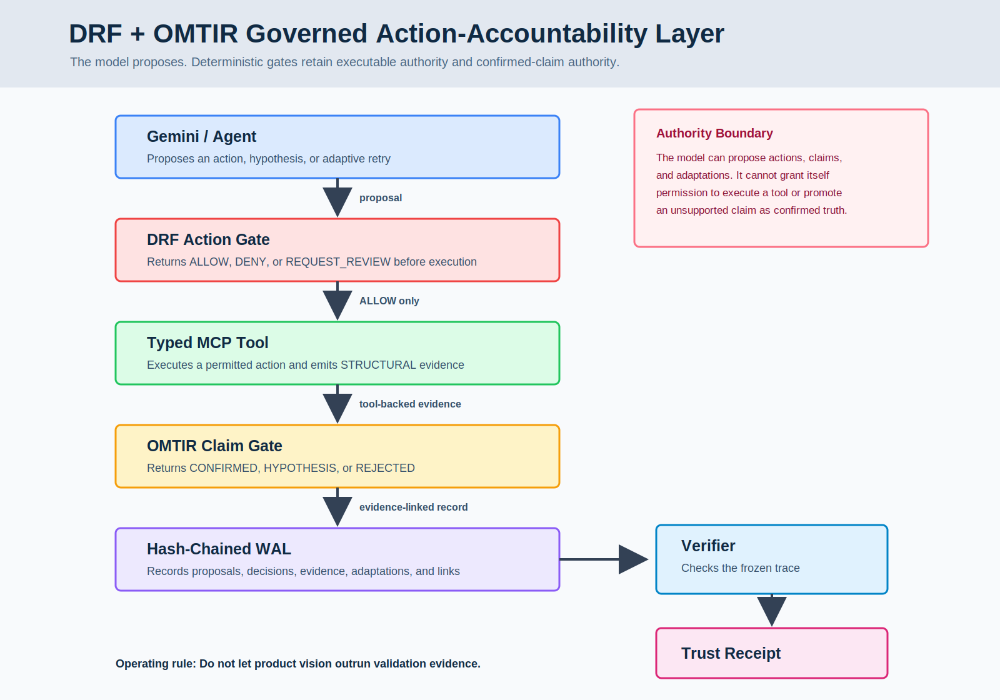

# DRF + OMTIR MCP Flight Recorder v0.1

Status: LOCAL_MCP_PROXY_AND_TRUST_RECEIPT_READY

DRF + OMTIR Flight Recorder is a local MCP governance proxy that keeps agent authority bounded and makes claims provable.



It is not a new agent, hosted service, dashboard, or enterprise RBAC layer. The v0.1 product surface is intentionally small:

```bash
drf-omtir init
drf-omtir wrap --policy drf-omtir.yaml -- mcp-server-command
drf-omtir demo
drf-omtir verify wal/demo.jsonl
drf-omtir receipt wal/demo.jsonl
```

## Install Locally

From this repository root:

```bash
python -m pip install -e .
```

Then confirm the CLI is available:

```bash
drf-omtir --help
```

## Decisive Demo

Run:

```bash
drf-omtir demo
```

Expected:

```text
delete_index             -> DENY
search_logs              -> ALLOW
unsupported CONFIRMED    -> REJECTED_HYPOTHESIS
evidence-linked claim    -> CONFIRMED
restart_service          -> REQUEST_REVIEW
WAL records              -> 5
Verifier                 -> PASS
Trust Receipt            -> generated
```

The demo writes:

```text
wal/demo.jsonl
reports/demo-verifier-report.json
receipts/demo-trust-receipt.md
examples/demo-search-logs-result.json
```

## Verify And Generate Receipt

```bash
drf-omtir verify wal/demo.jsonl
drf-omtir receipt wal/demo.jsonl
```

The verifier checks the hash-chained WAL and required governance events. The receipt command creates a human-readable Trust Receipt from the run.

## Policy Format

`drf-omtir init` creates `drf-omtir.yaml`. For v0.1 this file is JSON-compatible YAML so the package stays dependency-free.

## Public Evidence

The current public evidence ladder is indexed in:

```text
docs/DRF_OMTIR_EVIDENCE_LEDGER_v0.1.md
docs/FROZEN_ARTIFACT_HASH_TABLE_v0.1.md
docs/DRF_OMTIR_EXTERNAL_TECHNICAL_BRIEF_v0.1.md
```

This product package is a developer-facing MVP milestone. It should be read alongside the frozen validation packages, not as a replacement for them.

Launch and reviewer materials are in:

```text
docs/SHOW_HN_POST_v0.1.md
docs/DEVHUNT_SUBMISSION_COPY_v0.1.md
docs/PRODUCT_HUNT_TEASER_COPY_v0.1.md
docs/TERMINAL_DEMO_SCRIPT_90_SECONDS_v0.1.md
docs/release/RELEASE_NOTES_v0.1.md
```

## Boundary

This package demonstrates a local governance proxy, deterministic action policy, evidence-linked claim gating, hash-chained WAL verification, and Trust Receipt generation. It does not claim production deployment, cloud service readiness, universal MCP compatibility, external notarization, enterprise compliance, or adversarial security certification.

Do not let product vision outrun validation evidence.
